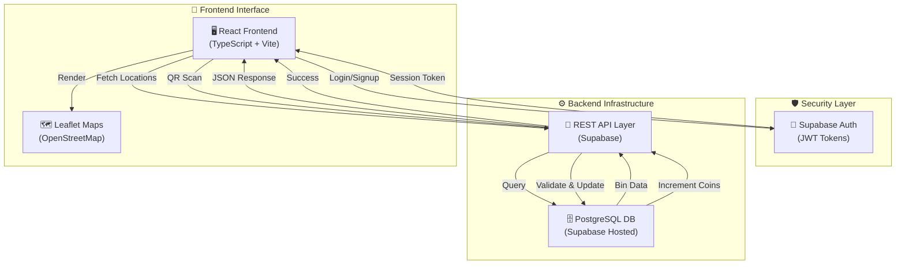

# 🌍 SmartBin – Smart Waste Management System

[](https://www.typescriptlang.org/)
[](https://react.dev)
[](https://vitejs.dev)
[](https://tailwindcss.com)
[](https://supabase.com)
[](https://leafletjs.com)
[](LICENSE)
[](https://github.com/ramichittibhavyasri/SmartBin)

> **Gamify Waste Management. Digitize Environmental Impact. Empower Communities.**
>
> A full-stack, production-ready web application that transforms waste management through location-aware bin tracking, QR-based verification, and a blockchain-inspired digital reward ecosystem.

---

## 📋 Table of Contents

- [Problem Statement](#problem-statement)
- [Solution Overview](#solution-overview)
- [Value Proposition](#value-proposition)
- [Key Features](#key-features)
- [Technology Stack](#technology-stack)
- [System Architecture](#system-architecture)
- [Project Structure](#project-structure)
- [Getting Started](#getting-started)
- [Environment Configuration](#environment-configuration)
- [Development Workflow](#development-workflow)
- [Deployment Guide](#deployment-guide)
- [Future Roadmap](#future-roadmap)
- [Contributing](#contributing)
- [Author](#author)

---

## 🎯 Problem Statement

### Current Challenges in Waste Management

**Municipal Waste Systems Today:**

| Challenge | Impact | Current State |
|-----------|--------|---------------|
| **Low Citizen Engagement** | Citizens lack motivation to dispose waste responsibly | Manual, non-incentivized participation |
| **Overflowing Waste Bins** | Sanitation workers waste time locating full bins across cities | Reactive, inefficient routing |
| **Lack of Real-time Visibility** | Municipalities cannot track waste streams or collection efficiency | Zero digital oversight |
| **Poor Route Optimization** | Garbage trucks traverse inefficient paths, increasing operational costs | Static, dated schedules |
| **Limited Environmental Accountability** | Citizens don't see their environmental impact quantified | Disconnected from personal contribution |
| **No Incentive Mechanism** | Waste segregation and responsible disposal are not rewarded | Voluntary participation only |

**Key Statistics:**
- 🌍 **Global Urban Waste**: 2.01 billion tonnes annually (World Bank, 2023)
- ♻️ **Recycling Rate Gap**: Only 9% of plastic waste is recycled globally
- 🚚 **Collection Inefficiency**: Up to 40% of collection routes are suboptimal

---

## 💡 Solution Overview

### SmartBin: A Gamified, Digitized Waste Revolution

SmartBin is a **full-stack, location-aware waste management platform** that combines:

- 🗺️ **Real-time Geolocation Tracking** – Identify waste bin locations and proximity via Leaflet-powered interactive maps
- 🔐 **QR-Based Verification** – Authenticate waste deposits with tamper-proof QR code scanning
- 💰 **Digital Reward Ecosystem** – Earn coins (points) for responsible waste disposal and recycling
- 📊 **Real-time Analytics Dashboard** – Visual feedback on environmental impact (CO2 saved, plastic recycled, water preserved)
- 🏆 **Gamification Framework** – Leaderboards, achievement badges, and tiered rewards to drive engagement
- 👥 **Multi-role User System** – Citizens, Municipal Corporations, Educational Institutions, Corporate Offices, and Administrators
- 🛒 **Integrated Marketplace** – Redeem coins for eco-friendly products and services

---

## 🎁 Value Proposition

### For Each Beneficiary

#### 👥 Citizens & Households
```
✓ Earn digital coins for every waste deposit (incentivized behavior)
✓ Track personal environmental impact in real-time
✓ Redeem coins in integrated marketplace for real products
✓ Compete in community leaderboards (gamified engagement)
✓ Access pickup scheduling via mobile-friendly interface
✓ Receive notifications for bin collection and rewards
```

#### 🏛️ Municipal Corporations
```
✓ Real-time bin status monitoring (fill levels, last collection timestamp)
✓ Optimized waste collection routing (reduce operational costs by ~30%)
✓ Data-driven insights on citizen participation and waste patterns
✓ Scalable digital infrastructure for city-wide waste management
✓ Integration with existing fleet management systems
✓ Compliance reporting and environmental accountability metrics
```

#### 🎓 Educational Institutions
```
✓ Integrate waste management into sustainability curriculum
✓ Campus-wide gamified competition among students/departments
✓ Real-time environmental impact tracking for awareness programs
✓ Alumni engagement through continued participation post-graduation
✓ Data for research on behavioral change through gamification
```

#### 🏢 Corporate Offices
```
✓ ESG (Environmental, Social, Governance) compliance tracking
✓ Employee wellness through gamified environmental initiatives
✓ Corporate social responsibility metrics and reporting
✓ Supply chain waste management integration
✓ Sustainability branding and green corporate image
```

#### 🌍 Environment
```
✓ Increased recycling rates and waste diversion from landfills
✓ Reduced collection vehicle emissions through optimized routing
✓ Data-driven waste reduction initiatives at scale
✓ Measurable environmental impact (CO2, water, plastic saved)
✓ Behavioral change toward sustainable waste practices
```

---

## ✨ Key Features

### 🔐 Authentication & User Management
- **Secure JWT-based authentication** via Supabase Auth
- **Role-based access control** (Citizen, Admin, Municipal Officer, Corporate Manager)
- **Social login support** (OAuth 2.0 integration ready)
- **Profile management** with location history and preferences
- **Session tracking** with login audit trails

### 🗺️ Geolocation & Mapping
- **Interactive Leaflet-powered map** with real-time bin locations
- **Reverse geocoding** via OpenStreetMap Nominatim API
- **Search-to-location functionality** with autocomplete
- **Current position detection** using Geolocation API
- **Proximity-based bin discovery** (find nearest bins within X km)
- **Custom marker clustering** for high-density areas

### 🔍 QR Code Verification
- **QR code generation** per user account
- **Downloadable & shareable** QR codes for distribution
- **Image capture component** for QR scanning
- **Deposit validation** via QR matching
- **Tamper-proof verification** system

### 💳 Digital Reward System
- **Real-time coin accumulation** on verified deposits
- **Dynamic reward multipliers** based on waste type/weight
- **Coin balance tracking** across sessions
- **Transaction history** with detailed breakdowns
- **Leaderboard rankings** (personal, community, regional)

### 🛒 Marketplace Integration
- **Product catalog** with eco-friendly items
- **Coin redemption** for products
- **Order management** system
- **Real-time cart** functionality
- **Order tracking** and delivery status

### 📊 Dashboard & Analytics
- **Personal impact metrics** (plastic recycled, CO2 saved, water preserved)
- **Activity timeline** with deposit/purchase history
- **Coins earned trends** visualization
- **Environmental contribution breakdown** (progress bars, charts)
- **Quick action buttons** (deposit simulation, marketplace, group management)

### 💬 AI-Powered Chatbot
- **Waste sorting guidance** (interactive classification)
- **Educational content** on recycling
- **Gamification encouragement** (motivation & tips)
- **Customer support** (FAQ, issue resolution)
- **Natural language understanding** with contextual responses

---

## 🏗️ Technology Stack

### Frontend Architecture

| Category | Technology | Version | Purpose |
|----------|-----------|---------|---------|
| **Runtime** | Node.js / Bun | LTS | JavaScript execution & package management |
| **Framework** | React | 18.3.1 | UI component library & state management |
| **Language** | TypeScript | 5.5.3 | Type-safe development & IDE support |
| **Build Tool** | Vite | 5.4.19 | Ultra-fast module bundler & dev server |
| **Styling** | Tailwind CSS | 3.4.11 | Utility-first CSS framework |
| **UI Components** | Radix UI + shadcn/ui | Latest | Headless component library |
| **Routing** | React Router | 6.26.2 | Client-side navigation |
| **Maps** | Leaflet.js | 1.9.4 | Open-source mapping library (OSM-based) |
| **API Communication** | Axios (Ready) | Planned | HTTP client for REST API calls |
| **Backend Integration** | Supabase JS | 2.50.0 | PostgreSQL + Auth + Realtime |
| **Data Fetching** | TanStack React Query | 5.56.2 | Server state management & caching |
| **Form Handling** | React Hook Form + Zod | Latest | Type-safe form validation |
| **Notifications** | Sonner + Toaster | 1.5.0 | Toast notifications (dark mode compatible) |
| **Icons** | Lucide React | 0.462.0 | Consistent icon library |
| **Charts** | Recharts | 2.12.7 | Data visualization |
| **Theming** | next-themes | 0.3.0 | Dark mode support |

### Backend Infrastructure

| Component | Technology | Purpose |
|-----------|-----------|---------|
| **Database** | PostgreSQL (via Supabase) | Relational data storage |
| **Auth Layer** | Supabase Auth (JWT) | Secure authentication & session management |
| **API Layer** | RESTful endpoints (Supabase) | Data query & mutation interface |
| **Realtime** | Supabase Realtime | Live updates & subscription streams |
| **Storage** | Supabase Storage | File uploads (QR codes, images) |
| **Migrations** | Supabase Migrations | Database schema versioning |

### Database Schema (PostgreSQL)

```sql
-- Core Tables
profile              -- User profiles with coins, QR codes
login                -- Login audit trail
smartbin_locations   -- Bin locations & status
deposits             -- Waste deposit transactions
orders               -- Marketplace orders
products             -- Eco-friendly product catalog
```

### DevOps & Code Quality

| Tool | Purpose |
|------|---------|
| **ESLint + TypeScript** | Code linting & type checking |
| **Prettier** | Code formatting |
| **Vite Config** | Component tagging (development) |
| **Environment Variables** | Secure configuration management |

---

## 🔄 System Architecture

### High-Level Data Flow



### User Journey: Registration → Deposit → Reward

```
1️⃣ REGISTRATION
   └─ User navigates to /auth
   └─ Submits username, email, password, location
   └─ Supabase validates & creates account
   └─ User assigned unique QR code
   └─ Redirects to dashboard

2️⃣ AUTHENTICATION
   └─ User logs in with email/password
   └─ JWT token generated
   └─ Profile fetched from `profile` table
   └─ Coins balance loaded (default: 1000)
   └─ Session stored in localStorage

3️⃣ LOCATION DISCOVERY
   └─ User clicks "Simulate Deposit"
   └─ Opens MapLocationPicker component
   └─ Leaflet map renders with default location
   └─ User searches for bin or clicks on map
   └─ Reverse geocoding provides address

4️⃣ QR VERIFICATION
   └─ User views QR code on dashboard
   └─ ImageCapture component ready for scanning
   └─ System validates QR matches user's code
   └─ Deposit transaction created in DB

5️⃣ POINT VALIDATION & ACCUMULATION
   └─ Backend validates deposit
   └─ Coins calculated based on waste type/weight
   └─ `deposits` table updated
   └─ User profile coins incremented
   └─ Real-time notification sent

6️⃣ MARKETPLACE REDEMPTION
   └─ User navigates to /marketplace
   └─ Browses eco-friendly products
   └─ Selects product and confirms order
   └─ Coins deducted, order created
   └─ User redirected to /orders for tracking
```

---

## 📁 Project Structure

```
SmartBin/
│
├── 📄 package.json                 # Root dependencies & scripts
├── 📄 tsconfig.json                # TypeScript configuration
├── 📄 vite.config.ts               # Vite build configuration
├── 📄 tailwind.config.ts           # Tailwind CSS theme
├── 📄 components.json              # shadcn/ui configuration
├── 📄 eslint.config.js             # ESLint rules
├── 📄 postcss.config.js            # PostCSS plugins
│
├── 📂 index.html                   # HTML entry point
│
├── 📂 src/
│   ├── 📂 main.tsx                 # React root & DOM mounting
│   ├── 📂 App.tsx                  # Route definitions & app layout
│   ├── 📂 index.css                # Global styles & Tailwind imports
│   ├── 📂 vite-env.d.ts            # Vite environment types
│   │
│   ├── 📂 pages/                   # Page-level components
│   │   ├── Index.tsx               # Landing page (features, CTA)
│   │   ├── Auth.tsx                # Login & signup form
│   │   ├── Dashboard.tsx           # User dashboard (coins, QR, stats)
│   │   ├── SmartBin.tsx            # Bin detection & deposit simulation
│   │   ├── Marketplace.tsx         # Product catalog & browsing
│   │   ├── ProductDetail.tsx       # Single product view & purchase
│   │   ├── Orders.tsx              # Order history & tracking
│   │   ├── Profile.tsx             # User profile management
│   │   └── NotFound.tsx            # 404 error page
│   │
│   ├── 📂 components/              # Reusable UI components
│   │   ├── Navbar.tsx              # Navigation bar (non-enhanced)
│   │   ├── EnhancedNavbar.tsx       # Advanced navbar with dropdowns
│   │   ├── MapLocationPicker.tsx   # Leaflet map integration
│   │   │   ├── Features:
│   │   │   │  • OpenStreetMap tiles rendering
│   │   │   │  • Reverse geocoding (Nominatim API)
│   │   │   │  • Location search with debouncing
│   │   │   │  • Marker placement on click
│   │   │   │  • Geolocation auto-detect
│   │   │
│   │   ├── ImageCapture.tsx        # QR code scanner component
│   │   ├── Chatbot.tsx             # Placeholder chatbot
│   │   ├── EnhancedChatbot.tsx      # AI-powered chatbot
│   │   │   ├── Features:
│   │   │   │  • Waste sorting guidance
│   │   │   │  • Educational responses
│   │   │   │  • Gamification tips
│   │   │   │  • Context-aware replies
│   │   │
│   │   └── 📂 ui/                  # shadcn/ui primitive components
│   │       ├── button.tsx
│   │       ├── card.tsx
│   │       ├── input.tsx
│   │       ├── label.tsx
│   │       ├── dialog.tsx
│   │       ├── select.tsx
│   │       ├── toast.tsx
│   │       ├── sonner.tsx
│   │       ├── tooltip.tsx
│   │       └── ... (40+ UI components)
│   │
│   ├── 📂 hooks/                   # Custom React hooks
│   │   └── (Ready for custom hooks)
│   │
│   ├── 📂 lib/                     # Utility functions
│   │   ├── utils.ts                # Class name merging, helpers
│   │
│   ├── 📂 services/                # API & external service integration
│   │   └── (Ready for API service layer)
│   │
│   └── 📂 integrations/
│       └── 📂 supabase/
│           ├── client.ts           # Supabase client initialization
│           └── types.ts            # TypeScript types (auto-generated)
│
├── 📂 public/                      # Static assets
│   └── favicon.svg
│
├── 📂 supabase/                    # Database configuration
│   ├── config.toml                 # Supabase local config
│   └── 📂 migrations/              # SQL schema migrations
│       └── (Database versioning)
│
├── 📄 .gitignore                   # Git exclusions
├── 📄 package-lock.json            # Dependency lock file
├── 📄 bun.lockb                    # Bun runtime lock file
└── 📄 README.md                    # This file
```

### Key Directory Annotations

| Directory | Purpose | Key Files |
|-----------|---------|-----------|
| `src/pages/` | Page-level components (routable views) | Dashboard, Auth, Marketplace |
| `src/components/` | Reusable UI components & integrations | MapLocationPicker, Chatbot |
| `src/components/ui/` | Radix UI + shadcn/ui base components | 40+ primitives for form/layout |
| `src/lib/` | Utility functions & helpers | utils.ts (clsx, cn merging) |
| `src/integrations/supabase/` | Backend integration layer | Auth, DB queries |
| `supabase/migrations/` | Database schema version control | SQL schema files |

---

## 🚀 Getting Started

### Prerequisites

Ensure you have the following installed:

```bash
✓ Node.js 18+ (or Bun runtime)
✓ Git
✓ npm or yarn package manager
✓ Supabase account (https://supabase.com)
```

### 1️⃣ Clone the Repository

```bash
git clone https://github.com/ramichittibhavyasri/SmartBin.git
cd SmartBin
```

### 2️⃣ Install Dependencies

```bash
# Using npm
npm install

# OR using Bun (faster)
bun install
```

### 3️⃣ Set Up Environment Variables

Create a `.env.local` file in the project root:

```bash
# Supabase Configuration
VITE_SUPABASE_URL=https://your-project.supabase.co
VITE_SUPABASE_ANON_KEY=your-anon-key-here

# Backend API (when deployed)
VITE_API_BASE_URL=http://localhost:3000/api

# Maps & Geolocation
VITE_MAP_DEFAULT_LAT=28.6139
VITE_MAP_DEFAULT_LNG=77.2090

# Feature Flags
VITE_ENABLE_CHATBOT=true
VITE_ENABLE_MARKETPLACE=true
```

#### Obtaining Supabase Credentials:

1. Go to [https://app.supabase.com](https://app.supabase.com)
2. Create a new project or select existing one
3. Navigate to **Settings → API** → Copy:
   - `URL` → `VITE_SUPABASE_URL`
   - `anon key` → `VITE_SUPABASE_ANON_KEY`

### 4️⃣ Start Development Server

```bash
# Using npm
npm run dev

# OR using Bun
bun run dev
```

The application will be available at: **`http://localhost:8080`**

```
  VITE v5.4.19  ready in 234 ms

  ➜  Local:   http://localhost:8080/
  ➜  press h + enter to show help
```

---

## ⚙️ Environment Configuration

### Complete `.env.example` Template

```env
# ============================================================================
# SUPABASE CONFIGURATION
# ============================================================================
# Obtain from: https://app.supabase.com → Project Settings → API

VITE_SUPABASE_URL=https://your-project-id.supabase.co
VITE_SUPABASE_ANON_KEY=eyJhbGciOiJIUzI1NiIsInR5cCI6IkpXVCJ9...

# ============================================================================
# BACKEND API CONFIGURATION
# ============================================================================
# Set to your backend server (local, staging, or production)

VITE_API_BASE_URL=http://localhost:3000/api
VITE_API_TIMEOUT=30000

# ============================================================================
# GEOLOCATION & MAPPING
# ============================================================================
# Default coordinates for map rendering (latitude, longitude)
# Default: Delhi, India

VITE_MAP_DEFAULT_LAT=28.6139
VITE_MAP_DEFAULT_LNG=77.2090
VITE_MAP_DEFAULT_ZOOM=15

# ============================================================================
# FEATURE FLAGS
# ============================================================================
# Enable/disable experimental or optional features

VITE_ENABLE_CHATBOT=true
VITE_ENABLE_MARKETPLACE=true
VITE_ENABLE_LEADERBOARD=true
VITE_ENABLE_GROUP_MANAGEMENT=false

# ============================================================================
# JWT & SECURITY
# ============================================================================
# JWT expiration time (handled by Supabase)

VITE_JWT_EXPIRY=3600

# ============================================================================
# ANALYTICS & MONITORING (Optional)
# ============================================================================

VITE_ANALYTICS_KEY=
VITE_SENTRY_DSN=

# ============================================================================
# BUILD & DEPLOYMENT
# ============================================================================

VITE_APP_NAME=SmartBin
VITE_APP_VERSION=1.0.0
VITE_ENVIRONMENT=development
```

---

## 🔧 Development Workflow

### Available npm Scripts

#### 🏃 Development & Running

```bash
# Start Vite dev server (hot reload enabled)
npm run dev

# Build for production
npm run build

# Build in development mode (unminified for debugging)
npm run build:dev

# Preview production build locally
npm run preview
```

#### 🔍 Code Quality

```bash
# Run ESLint to check code quality
npm run lint

# (Optional) Fix ESLint issues automatically
npm run lint -- --fix
```

#### 📦 Package Management

```bash
# Install all dependencies
npm install

# Add a new dependency
npm install package-name

# Remove a dependency
npm uninstall package-name
```

### Typical Development Cycle

```bash
# 1. Start dev server
npm run dev

# 2. Make code changes (hot reload automatic)

# 3. Commit changes
git add .
git commit -m "feat: add new feature"

# 4. Run linter before pushing
npm run lint

# 5. Build for production check
npm run build

# 6. Push to repository
git push origin feature-branch
```

---

## 🌐 Deployment Guide

### Deploy to Netlify (Recommended)

#### Step 1: Connect Repository

1. Go to [https://app.netlify.com](https://app.netlify.com)
2. Click **"Connect a Git repository"**
3. Select **GitHub** → Authorize
4. Select **ramichittibhavyasri/SmartBin**

#### Step 2: Configure Build Settings

| Setting | Value |
|---------|-------|
| **Build Command** | `npm run build` |
| **Publish Directory** | `dist/` |
| **Node Version** | `18.x` or higher |

#### Step 3: Set Environment Variables

In **Site Settings → Build & Deploy → Environment**:

```
VITE_SUPABASE_URL=https://your-project.supabase.co
VITE_SUPABASE_ANON_KEY=your-anon-key
VITE_API_BASE_URL=https://api.smartbin.app/api
VITE_MAP_DEFAULT_LAT=28.6139
VITE_MAP_DEFAULT_LNG=77.2090
```

#### Step 4: Deploy

```bash
# Trigger deployment (automatic on push to main)
git push origin main

# Or manually trigger from Netlify dashboard
# → Deploys → Trigger deploy → Deploy site
```

### Deploy to Vercel

```bash
# Install Vercel CLI
npm i -g vercel

# Deploy
vercel

# Set environment variables when prompted
```

### Deploy to Docker (Self-Hosted)

```dockerfile
# Dockerfile
FROM node:18-alpine

WORKDIR /app

COPY package*.json ./
RUN npm ci

COPY . .
RUN npm run build

EXPOSE 3000

CMD ["npm", "run", "preview"]
```

```bash
# Build & run
docker build -t smartbin:latest .
docker run -p 3000:3000 \
  -e VITE_SUPABASE_URL=... \
  -e VITE_SUPABASE_ANON_KEY=... \
  smartbin:latest
```

---

## 🗺️ Future Roadmap

### Feature Development Checklist

#### Phase 1: Core Features ✅ (Current)
- [x] User authentication (Supabase JWT)
- [x] Dashboard with coin tracking
- [x] Leaflet map integration
- [x] QR code generation & display
- [x] Marketplace product catalog
- [x] Order management system
- [x] Profile management
- [x] Responsive UI (mobile & desktop)
- [x] Dark mode support

#### Phase 2: Intelligence & Optimization 🚀 (Q3 2024)
- [ ] **AI-Based Waste Classification**
  - Computer Vision API for waste type detection
  - Real-time waste segregation guidance
  - Model: YOLOv8 for image classification
  - Feature: Photo upload to classify waste automatically

- [ ] **IoT-Enabled Real-Time Fill Level Sensors**
  - Integration with smart bin hardware
  - Capacitive sensors for fill level detection
  - MQTT protocol for device communication
  - Realtime notifications when bins near capacity
  - Data visualization on admin dashboard

- [ ] **Advanced Route Optimization**
  - Traveling Salesman Problem (TSP) solver
  - Google OR-Tools integration
  - Real-time traffic factor consideration
  - Fleet management dashboard
  - Cost reduction: ~30% estimated

#### Phase 3: Community & Scaling 🌍 (Q4 2024)
- [ ] **Leaderboard & Social Features**
  - Global, regional, and community leaderboards
  - Social sharing (Twitter, WhatsApp)
  - Achievement badges & trophies
  - Referral program (earn coins for invites)

- [ ] **Group Management**
  - Create/join waste management groups
  - Group leaderboards
  - Bulk deposit tracking
  - Group milestone rewards

- [ ] **Mobile App (React Native)**
  - iOS & Android native apps
  - Offline mode support
  - Push notifications
  - Biometric authentication

#### Phase 4: Enterprise & Governance 📊 (2025)
- [ ] **Administrative Dashboard**
  - Real-time analytics & reporting
  - User management & moderation
  - Bin location management
  - Reward pool management
  - CSV/PDF export functionality

- [ ] **Municipal Integration APIs**
  - OpenAPI/REST endpoints
  - GraphQL subscriptions
  - Webhook support for events
  - Rate limiting & API key management

- [ ] **Blockchain Integration (Optional)**
  - Immutable transaction ledger
  - NFT badges for achievements
  - Smart contract for rewards distribution
  - Transparency & trust verification

- [ ] **Multi-language Support**
  - i18n framework setup
  - Support: English, Hindi, Spanish, Mandarin
  - RTL language support

#### Phase 5: ML & Predictive Analytics 🤖 (2025+)
- [ ] **Predictive Bin Fullness**
  - Time-series forecasting (LSTM models)
  - Predict collection needs 24-48 hours ahead
  - Optimize collection schedules

- [ ] **Citizen Behavior Prediction**
  - Recommend optimal deposit times
  - Personalized reward suggestions
  - Churn prediction & retention strategies

- [ ] **Environmental Impact Scoring**
  - Machine learning-based impact calculation
  - Dynamic rewards based on seasonality
  - Carbon footprint reduction tracking

### Estimated Development Timeline

| Phase | Duration | Status |
|-------|----------|--------|
| Phase 1 | Complete | ✅ Released |
| Phase 2 | 3-4 months | 🚀 Q3 2024 |
| Phase 3 | 4-5 months | 🚀 Q4 2024 |
| Phase 4 | 5-6 months | 🚀 Q1-Q2 2025 |
| Phase 5 | Ongoing | 🚀 2025+ |

---

## 🤝 Contributing

We welcome contributions from developers, designers, and environmental enthusiasts! 

### How to Contribute

1. **Fork the repository**
   ```bash
   git clone https://github.com/YOUR_USERNAME/SmartBin.git
   ```

2. **Create a feature branch**
   ```bash
   git checkout -b feature/amazing-feature
   ```

3. **Make your changes**
   - Follow TypeScript & ESLint conventions
   - Add comments for complex logic
   - Test thoroughly before committing

4. **Commit with clear messages**
   ```bash
   git commit -m "feat: add amazing feature"
   ```

5. **Push to your fork**
   ```bash
   git push origin feature/amazing-feature
   ```

6. **Open a Pull Request**
   - Provide detailed description
   - Link related issues
   - Include screenshots for UI changes

### Code Style Guidelines

```typescript
// ✅ DO: Use const for immutability
const handleClick = () => { /* ... */ };

// ✅ DO: Use destructuring
const { user, coins } = userData;

// ✅ DO: Add type annotations
const fetchCoins = async (userId: string): Promise<number> => { /* ... */ };

// ❌ DON'T: Use var
var x = 5;

// ❌ DON'T: Omit types
const result = getSomething();
```

### Setting Up Development Environment

```bash
# Install dependencies
npm install

# Install pre-commit hooks (optional but recommended)
npm install husky lint-staged --save-dev
npx husky install

# Run linter & tests before committing
npm run lint
```

---

## 📞 Support & Contact

### Documentation
- 📖 [Full Technical Documentation](./docs/TECHNICAL.md)
- 🎨 [Design System Guide](./docs/DESIGN.md)
- 🔌 [API Reference](./docs/API.md)

### Get Help
- 🐛 [Report Bugs](https://github.com/ramichittibhavyasri/SmartBin/issues)
- 💡 [Feature Requests](https://github.com/ramichittibhavyasri/SmartBin/discussions)
- 💬 [Discord Community](https://discord.gg/smartbin)

---

## 👨‍💻 Author

**Bandari Prabhas**

- 🔗 GitHub: [@ramichittibhavyasri](https://github.com/ramichittibhavyasri)
- 📧 Email: [contact@smartbin.app](mailto:contact@smartbin.app)
- 🌐 Portfolio: [bandari-prabhas.dev](https://bandari-prabhas.dev)

---

## 📄 License

This project is licensed under the **MIT License** – see the [LICENSE](./LICENSE) file for details.

```
MIT License

Copyright (c) 2024 Bandari Prabhas

Permission is hereby granted, free of charge, to any person obtaining a copy
of this software and associated documentation files (the "Software"), to deal
in the Software without restriction, including without limitation the rights
to use, copy, modify, merge, publish, distribute, sublicense, and/or sell
copies of the Software...
```

---

## 🌟 Acknowledgments

### Technologies & Resources

- **React & Vite** – For blazing-fast frontend development
- **Tailwind CSS** – For beautiful, responsive design
- **Supabase** – For backend infrastructure & authentication
- **Leaflet.js** – For open-source mapping
- **OpenStreetMap** – For free, open geographic data
- **Radix UI & shadcn/ui** – For accessible components
- **TanStack React Query** – For data synchronization

### Inspiration & References

- UN Sustainable Development Goal 12: Responsible Consumption & Production
- World Bank Solid Waste Management Initiatives
- Singapore Smart Bins Project
- Seoul Waste Management System (Korea)
- Copenhagen Circular Economy Framework

---

## 🎯 Vision

**SmartBin aspires to transform global waste management through:**

- 🌍 **Scale**: Making gamified waste management accessible to 100M+ users by 2030
- 🤝 **Partnership**: Collaborating with municipalities, corporations, and NGOs worldwide
- 🔬 **Innovation**: Leveraging AI, IoT, and blockchain for transparency & efficiency
- 📈 **Impact**: Diverting 1 billion tonnes of waste from landfills annually
- 💚 **Sustainability**: Building a circular economy where waste becomes a resource

---

<div align="center">

### ⭐ If you find SmartBin useful, please give it a star! ⭐

**Together, we can turn waste into opportunity and create a sustainable future.**

---

**Made with 💚 for our Planet**

</div>
